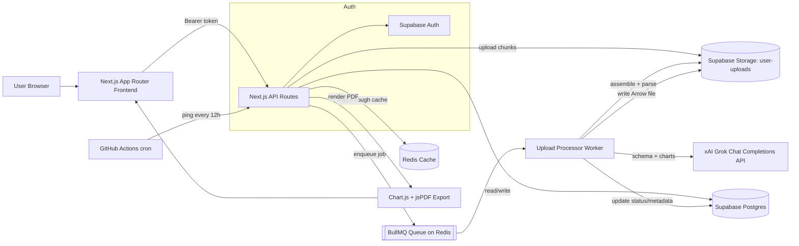
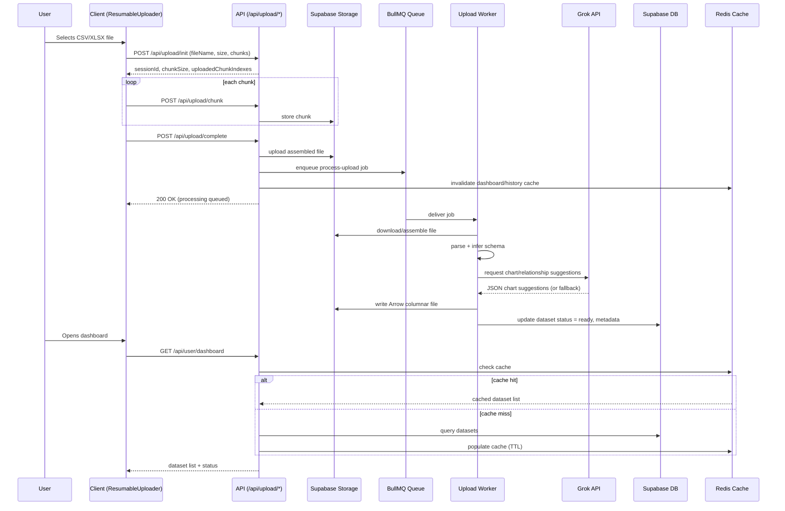
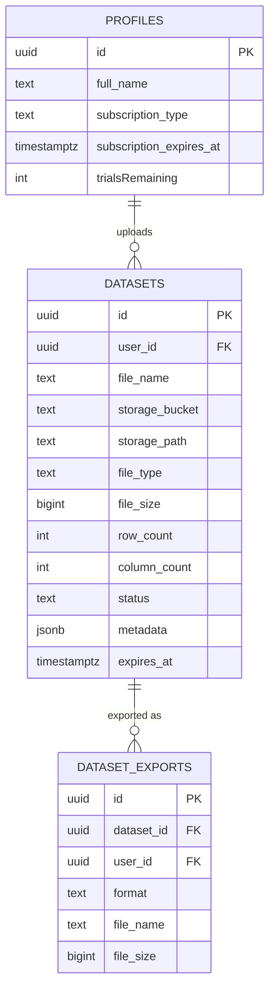

# VizSmith

Turn a raw CSV/XLSX file into an AI-annotated dashboard of charts, exportable to PDF — with resumable chunked uploads and a Redis-cached, queue-backed processing pipeline.

**Live app:** https://vizsmith-ai.vercel.app
**Repository:** https://github.com/durgaprasadg1/viz-Smith

---

## Overview

VizSmith is a full-stack Next.js (App Router) application that lets a signed-in user upload a dataset (CSV or XLSX), automatically infers its schema, asks an LLM to suggest meaningful chart relationships between columns, renders those charts, and lets the user export the result as a PDF report.

The interesting engineering surface isn't the charting itself — it's everything around getting an arbitrary, possibly large, user-uploaded spreadsheet from "raw bytes" to "analyzed dataset" reliably:

- Large files are uploaded in **resumable chunks** directly against a REST API, with session state tracked server-side so an interrupted upload can resume instead of restarting.
- The actual parsing, type inference, chart-relationship detection, and Apache Arrow conversion happen **off the request path**, in a **BullMQ/Redis worker process**, so the API can respond immediately after the raw file lands in storage.
- Read-heavy user pages (dashboard, history) sit behind a **Redis read-through cache** with explicit invalidation on writes, tracked via a `plan.md` rollout checklist committed to the repo.
- Column-relationship discovery is delegated to an **LLM (xAI's Grok endpoint)** with a strict retry policy and a non-AI fallback path, since third-party AI calls are the least reliable part of the pipeline.

## Key Features

- **CSV/XLSX ingestion with schema inference** — column type detection, delimiter sniffing for CSV, and sheet detection for XLSX (`lib/dataset-analysis.js`).
- **Resumable, chunked uploads** — files are split client-side and uploaded chunk-by-chunk (`app/api/upload/init`, `/chunk`, `/complete`, `/status`), so a dropped connection doesn't force a re-upload from byte zero.
- **Background processing via a job queue** — uploads enqueue a `process-upload` job on a BullMQ queue; a separate worker (`workers/upload-processor.js`) assembles chunks, parses the file, and updates the dataset row when done.
- **AI-assisted chart suggestions** — the pipeline sends a sample of the parsed data to an LLM and asks it to propose column pairings and chart types (bar, line, pie, scatter, histogram, etc.), with alias normalization and a retry-with-backoff wrapper (`getGrokChartSuggestionsWithRetries`).
- **Apache Arrow columnar caching** — after analysis, the full dataset is also written to storage as an Arrow IPC stream (`lib/arrow-conversion.js`) so downstream reads don't need to re-parse the original CSV/XLSX.
- **Redis-backed read caching with write invalidation** — dashboard, history, and per-dataset reads are cached with TTLs and explicitly invalidated on upload/cleanup, following a documented rollout plan (`plan.md`).
- **PDF export with rendered charts** — server-side chart rendering via `chart.js` + `chartjs-node-canvas`, embedded into a generated PDF via `jspdf` (`lib/exporters.js`).
- **Supabase-backed auth, storage, and Postgres** — email/password auth, per-user row-level security on `datasets` and `dataset_exports`, and a dedicated `user-uploads` storage bucket.
- **Keep-alive cron job** — a GitHub Actions workflow pings a `/api/stay-awake` endpoint every 12 hours to prevent the Supabase project from pausing due to inactivity.

## Demo / Screenshots

> **Placeholder:** add screenshots/GIFs of the dashboard, the upload flow (chunk progress), a generated chart set, and a sample PDF export here. The `public/image` and `public/3d` folders contain chart-type illustration assets used in the landing page hero, not product screenshots.

---

## System Architecture



**Frontend:** Next.js 16 App Router with route groups for `(auth)` and `(user)`, React 19, MUI + Radix/shadcn-derived components, Recharts/Chart.js for in-browser charts, and a custom `ResumableUploader` component driving chunked uploads.

**API layer:** Route handlers under `app/api/**` (Node.js runtime), each authenticating the caller via a Supabase-issued bearer token before touching data.

**Background processing:** A standalone worker (`workers/upload-processor.js`) built on BullMQ, connected to the same Redis instance used for caching, consuming an `upload-processing` queue.

**Data & storage:** Supabase Postgres for relational data (`datasets`, `dataset_exports`, `profiles`) and Supabase Storage for raw files, assembled files, and Arrow columnar exports.

**External AI service:** Column-relationship/chart-type suggestions are fetched from `https://api.x.ai/v1/chat/completions` (Grok), with a bounded retry loop and a documented fallback when the AI response is empty or errors out.

## Request / Data Flow — Upload → Analysis → Dashboard



---

## Tech Stack

| Layer | Technology | Purpose |
|---|---|---|
| Frontend | Next.js 16 (App Router), React 19 | Routing, server/client components, UI |
| Styling/UI | Tailwind CSS 4, MUI, Radix UI, shadcn-derived components | Component library and design system |
| Charting (client) | Recharts, Chart.js | In-app interactive chart rendering |
| Charting (server) | Chart.js + `chartjs-node-canvas` (via `canvas`) | Headless chart rendering for PDF export |
| Auth & DB | Supabase (Postgres + Auth) | User accounts, row-level-secured dataset storage |
| File storage | Supabase Storage | Raw uploads, assembled chunk uploads, Arrow files |
| Background jobs | BullMQ + Redis | Decouples heavy file processing from the request/response cycle |
| Caching | `redis` client, custom read-through helpers (`lib/redis-cache.js`) | TTL-based caching of dashboard/history/dataset reads |
| Columnar format | Apache Arrow (`apache-arrow`) | Efficient, schema-stable representation of parsed datasets |
| File parsing | `csv-parse`, `xlsx` | CSV and Excel ingestion |
| AI | xAI Grok Chat Completions API (raw `fetch`, no SDK) | Suggests chart types/column relationships from a data sample |
| PDF export | `jspdf`, `jspdf-autotable` | Generates the exported report with embedded chart images |
| Forms | `@tanstack/react-form` | Auth and upload form state |
| Tables | `@tanstack/react-table` | History/dataset row browsing |

> Note: `groq-sdk` and `pptxgenjs` are present in `package.json` but are not wired into any executed code path — see [Known Limitations](#known-limitations).

## Repository Structure

```text
app/
├── (auth)/            # /login, /signup route group
├── (user)/            # /dashboard, /history, /upload route group
├── api/
│   ├── auth/          # login, signup route handlers
│   ├── upload/        # init, chunk, complete, status, and legacy single-shot upload
│   ├── dataset/rows/  # paginated row access for a processed dataset
│   ├── export/        # PDF export generation
│   ├── user/          # dashboard, history read endpoints (Redis-cached)
│   └── stay-awake/     # keep-alive endpoint pinged by GitHub Actions
├── Components/        # feature-organized React components (DashBoard, Home, User)
└── layout.jsx, page.jsx

lib/                   # framework-agnostic core logic
├── dataset-analysis.js    # parsing, type inference, AI chart-relationship detection
├── chart-preparation.js   # turns AI/analysis output into renderable chart specs
├── arrow-conversion.js    # streaming/batch Arrow IPC writer
├── exporters.js           # PDF generation (chart rendering + jsPDF)
├── upload-optimization.js # chunk/session bookkeeping for resumable uploads
├── redis-cache.js         # read-through cache + invalidation helpers
├── queue.js               # BullMQ queue definition
├── api-route-auth.js      # bearer-token → Supabase user resolution
├── supabase.js            # Supabase client factory
└── db.sql                 # full Postgres schema, RLS policies, triggers

workers/
└── upload-processor.js  # standalone BullMQ worker (separate process from the web server)

hooks/                  # useAuth (client auth state), useAuthenticatedRedirect
utils/                  # small view-layer helpers (dashboard, history, auth-form)
components/ui/          # shadcn-derived primitive UI components
```

The separation between `app/api` (thin route handlers), `lib/` (pure/business logic), and `workers/` (a process that runs independently of the Next.js server) is the main architectural boundary in this codebase.

---

## Engineering Decisions

### Background processing via BullMQ instead of processing on the upload request

**Decision:** The upload route only stores the raw file and enqueues a job; all parsing, AI calls, and Arrow conversion happen in a separate worker process (`workers/upload-processor.js`).

**Why:** Parsing large spreadsheets, calling an external LLM, and writing an Arrow file are all slow and/or flaky operations. Doing them inline would tie up the serverless function for the full duration and risk platform request timeouts.

**Trade-off:** The system is now eventually consistent — a dataset briefly sits in `uploaded`/`processing` status before becoming `ready`. The frontend has to poll or subscribe for status rather than getting a synchronous result, and a separate worker process (with its own Redis connection) has to be deployed and kept running alongside the Next.js app.

### Resumable chunked uploads with a client-generated file key

**Decision:** Large files are split into chunks and uploaded via `init` → repeated `chunk` → `complete`, with an idempotent `fileKey` derived from file name/size/`lastModified` so a resumed session can find already-uploaded chunks (`lib/upload-optimization.js`).

**Why:** A single large multipart POST is fragile on unreliable networks; resumability meaningfully improves the experience for bigger CSV/XLSX files without needing a third-party upload service.

**Trade-off:** This adds real complexity — session state, chunk bookkeeping, and cleanup all live in application code rather than being delegated to a managed upload provider, and partial/orphaned chunk sets need explicit cleanup handling.

### Redis as a read-through cache with explicit write-side invalidation

**Decision:** Dashboard, history, and per-dataset reads are cached in Redis with TTLs (`CACHE_TTL_SECONDS`), and every write path (upload, cleanup) explicitly deletes the relevant cache keys (`invalidateUserDatasetCaches`).

**Why:** These are the most frequently read, per-user endpoints in the app; caching them cuts repeated Supabase reads. The rollout was planned and tracked incrementally in `plan.md` rather than being introduced in one uncoordinated change.

**Trade-off:** Cache invalidation is manual and per-code-path — a future write path that forgets to invalidate the cache will silently serve stale data. There's also no cache stampede protection; concurrent misses can all hit Supabase simultaneously.

### LLM-based chart-relationship detection with a retry/fallback strategy

**Decision:** A sample of parsed rows and column metadata is sent to Grok's chat completions endpoint to suggest chart types and column relationships, wrapped in `getGrokChartSuggestionsWithRetries` (bounded retries with backoff) and a fallback relationship list when the AI call fails or returns unusable JSON.

**Why:** Automatically proposing "which columns make an interesting chart" is a genuinely hard heuristic problem; an LLM with a data sample can reasonably guess useful pairings (e.g., category vs. numeric → bar chart) without hand-written rules for every schema shape.

**Trade-off:** The pipeline now depends on a third-party API's availability, latency, and cost. The code defends against this with a timeout (`AI_REQUEST_TIMEOUT_MS`), a bounded number of attempts, and a non-AI fallback path — but chart quality is not guaranteed to be consistent across runs.

### Supabase Row-Level Security instead of application-level authorization checks

**Decision:** Authorization is enforced primarily at the database layer — RLS policies on `datasets` and `dataset_exports` restrict rows to `auth.uid() = user_id` (`lib/db.sql`) — with route handlers additionally authenticating the bearer token and using a request-scoped Supabase client.

**Why:** Pushing authorization into RLS means a bug in a route handler's `WHERE` clause can't leak another user's data; the database itself refuses the query.

**Trade-off:** RLS policies are harder to unit test than application code, and the export route additionally uses the Supabase **service role key** to fetch storage objects, which bypasses RLS by design — that code path has to be careful not to trust unvalidated input.

---

## API Design

| Method | Endpoint | Description | Auth |
|---|---|---|---|
| POST | `/api/auth/login` | Email/password sign-in via Supabase Auth | No |
| POST | `/api/auth/signup` | New user registration | No |
| POST | `/api/upload` | Single-shot or chunk-aware upload (legacy/simple path) | Yes |
| POST | `/api/upload/init` | Start or resume a chunked upload session | Yes |
| POST | `/api/upload/chunk` | Upload one chunk of a session | Yes |
| POST | `/api/upload/complete` | Finalize a chunked session, enqueue processing | Yes |
| GET | `/api/upload/status` | Poll processing status of a dataset | Yes |
| GET | `/api/user/dashboard` | List the user's datasets (Redis-cached) | Yes |
| GET | `/api/user/history` | Paginated dataset history (Redis-cached) | Yes |
| GET | `/api/dataset/rows` | Fetch rows for a processed dataset | Yes |
| POST | `/api/export` | Generate a PDF export for a dataset | Yes |
| GET | `/api/stay-awake` | Keep-alive endpoint for the Supabase project | No |

Auth is enforced per-route via `getAuthorizedUserFromRequest` (`lib/api-route-auth.js`), which resolves a `Bearer` token to a Supabase user and rejects the request with `401` if the token is missing or invalid. There is no separate OpenAPI/Swagger document in the repository.

---

## Data Model



Notable schema decisions visible in `lib/db.sql`:

- `datasets.status` is constrained to `uploaded | processing | ready | failed`, giving the worker/API a shared vocabulary for pipeline state.
- `datasets.expires_at` defaults to `now() + 2 days`, implying datasets are intended to be short-lived/disposable rather than a permanent archive.
- Multiple targeted indexes exist for the actual access patterns: `(user_id, created_at desc)`, `(user_id, status, created_at desc)`, a case-insensitive file-name index, and a GIN index on the `metadata` JSONB column.
- `profiles.id` is a foreign key directly to `auth.users(id)`, and a `handle_new_user()` trigger auto-creates a profile row on signup — but `datasets.user_id` also references `auth.users(id)` directly (not `profiles`), so dataset access doesn't depend on a profile row existing.
- A `subscription_type` column (`free | silver | gold | platinum`) and `trialsRemaining` exist on `profiles`, indicating a metering/paywall model was designed, though no route handler in the repository currently reads or enforces these fields.

---

## Authentication & Authorization

- **Sign-up/login** are handled through Supabase Auth's email/password flow (`app/api/auth/signup`, `app/api/auth/login`), which issues a Supabase session/JWT.
- The client persists this session via `@supabase/supabase-js` and exposes it through the `useAuth` hook, which subscribes to `onAuthStateChange`.
- Every protected API route extracts the bearer token from the `Authorization` header and re-validates it against Supabase (`supabase.auth.getUser(token)`) rather than trusting a client-supplied user ID — see `lib/api-route-auth.js`.
- Row-level security in Postgres (`lib/db.sql`) is the actual authorization boundary for `datasets` and `dataset_exports`: policies restrict `select`/`insert`/`update`/`delete` to rows where `auth.uid() = user_id`.
- The export route additionally instantiates a Supabase client with the **service role key** (bypassing RLS) specifically to read files from Storage across bucket/path variations — this key must never be exposed to the client and is only used server-side.

---

## Security

**Implemented:**
- Server-side re-validation of bearer tokens on every protected route (no trusting client-asserted identity).
- Database-level row-level security scoping all dataset/export access to the owning user.
- File type/extension allow-listing and a 50MB size cap on uploads (`ALLOWED_TYPES`, `MAX_FILE_SIZE` in `lib/dataset-analysis.js`).
- Filename sanitization before use in storage paths (`sanitizeFileName`), reducing path-traversal/odd-character risk.
- Service-role (privileged) Supabase key usage is isolated to a single export code path rather than used broadly.

**Not implemented / not verifiable from the repository:**
- No visible rate limiting on auth or upload endpoints.
- No CSRF protection layer beyond what Next.js/Supabase provide by default.
- No explicit CORS configuration was found in the codebase.
- No secret-scanning or dependency-audit tooling configured in CI.

---

## Performance & Scalability

**Implemented:**
- Heavy work (parsing, AI calls, Arrow conversion) is offloaded to a BullMQ worker so API responses aren't blocked on it.
- Streaming Arrow conversion (`convertRowsToArrowStreamBuffer`, batch size 5000) avoids holding the entire dataset as JS arrays in memory during conversion, with an in-memory fallback if streaming fails.
- Redis read-through caching (with TTLs configurable per-endpoint via `CACHE_TTL_DASHBOARD_SECONDS`, `CACHE_TTL_HISTORY_SECONDS`, `CACHE_TTL_DATASET_SECONDS`) reduces repeated Supabase reads on hot paths.
- Targeted Postgres indexes exist for the actual dashboard/history query shapes (see [Data Model](#data-model)).

### Scalability Improvements

- The worker is a single long-running process reading from one BullMQ queue; horizontal scaling would mean running multiple worker instances/replicas against the same Redis-backed queue.
- There's no visible cache stampede protection (e.g., request coalescing or lock-on-miss) for the Redis layer.
- Dataset row count is capped implicitly by the 50MB upload limit and in-memory analysis steps; genuinely large files would need a fully streaming analysis path rather than the current buffer-based one for the non-chunked upload endpoint.

---

## Error Handling & Reliability

- Upload errors are classified through a shared `classifyUploadError` helper (`lib/upload-errors.js`), giving consistent `{ error, code, status }` shapes across the chunked-upload endpoints instead of ad hoc error strings.
- The worker sets `status: 'failed'` on a dataset row (with the error message recorded in `metadata`) if processing throws, so the frontend can surface a failure state instead of leaving a dataset stuck in `processing` indefinitely.
- PDF export falls back to a table-only export (no charts) if chart image rendering fails, rather than failing the entire export.
- The AI chart-suggestion call has a bounded timeout (`AbortController` + `AI_REQUEST_TIMEOUT_MS`) and a bounded retry count with backoff, followed by a non-AI fallback relationship list — the pipeline does not hang or hard-fail if the LLM is slow or unavailable.
- Redis operations (`getJsonCache`/`setJsonCache`/`deleteCacheKeys`) catch and log errors internally and return `null`/`false` on failure, so a Redis outage degrades to direct Supabase reads (fail-open) rather than breaking the request.
- A scheduled GitHub Actions workflow pings `/api/stay-awake` every 12 hours to prevent the Supabase project from auto-pausing on the free tier.

---

## Testing

No automated test suite (unit, integration, or end-to-end) is present in the repository, and no test runner is configured in `package.json`. The only checked scripts are:

```bash
npm run lint    # ESLint (eslint-config-next)
npm run build   # Next.js production build
```

This is called out explicitly under [Known Limitations](#known-limitations) rather than implied.

---

## Local Development

**Prerequisites:**
- Node.js (compatible with Next.js 16 / React 19)
- A Supabase project (Postgres + Auth + Storage)
- A Redis instance (for both caching and the BullMQ queue)
- An xAI (Grok) API key, if AI chart suggestions are desired — the app runs without it, using the fallback relationship logic

**Setup:**

```bash
# 1. Clone
git clone https://github.com/durgaprasadg1/viz-Smith.git
cd viz-Smith

# 2. Install dependencies
npm install

# 3. Configure environment
cp .env.example .env.local   # create this file — see Environment Variables below
# fill in Supabase, Redis, and Grok values

# 4. Initialize the database
# Run lib/db.sql against your Supabase project's SQL editor
# (creates tables, RLS policies, triggers, and the user-uploads storage bucket)

# 5. Start the Next.js app
npm run dev

# 6. Start the background worker (separate process, required for uploads to finish processing)
node workers/upload-processor.js
```

Open http://localhost:3000.

> No `.env.example` currently exists in the repository — the variable names below were derived directly from `process.env.*` references in the code.

## Environment Variables

```env
NEXT_PUBLIC_SUPABASE_URL=
NEXT_PUBLIC_SUPABASE_ANON_KEY=
SUPABASE_SERVICE_ROLE_KEY=
SERVICE_ROLE_KEY=

REDIS_URL=
REDIS_HOST=
REDIS_PORT=
REDIS_PASSWORD=

GROK_API_KEY=
GROK_TIMEOUT_MS=
AI_REQUEST_TIMEOUT_MS=
AI_RELATIONSHIP_TARGET=

CACHE_TTL_SECONDS=
CACHE_TTL_DASHBOARD_SECONDS=
CACHE_TTL_HISTORY_SECONDS=
CACHE_TTL_DATASET_SECONDS=

UPLOAD_SESSIONS_ROOT=
```

| Variable | Required | Purpose |
|---|---|---|
| `NEXT_PUBLIC_SUPABASE_URL` | Yes | Supabase project URL (client + server) |
| `NEXT_PUBLIC_SUPABASE_ANON_KEY` | Yes | Public anon key for client-side/session-scoped Supabase calls |
| `SUPABASE_SERVICE_ROLE_KEY` / `SERVICE_ROLE_KEY` | Yes (for export) | Privileged key used server-side to read storage objects during export, bypassing RLS |
| `REDIS_URL` (or `REDIS_HOST`/`REDIS_PORT`/`REDIS_PASSWORD`) | Yes | Connection for both the BullMQ queue and the Redis cache |
| `GROK_API_KEY` | No | Enables AI-based chart/relationship suggestions; falls back gracefully if unset |
| `GROK_TIMEOUT_MS` / `AI_REQUEST_TIMEOUT_MS` | No | Timeout for the Grok API call (defaults to 18s) |
| `AI_RELATIONSHIP_TARGET` | No | Max number of chart relationships requested from the AI (default 40) |
| `CACHE_TTL_*` | No | Per-endpoint Redis cache TTLs in seconds (default 600) |
| `UPLOAD_SESSIONS_ROOT` | No | Referenced by the upload optimization module; controls where session bookkeeping is scoped |

No secret values are included above — only variable names, matching what the code actually reads.

---

## Deployment

The app is deployed on **Vercel** (`vizsmith-ai.vercel.app`, referenced in the GitHub Actions keep-alive workflow). There is no Dockerfile, docker-compose file, or Kubernetes manifest in the repository.

The only CI/CD-adjacent automation present is a scheduled GitHub Actions workflow:

```text
Cron (every 12 hours) or manual dispatch
        ↓
curl https://vizsmith-ai.vercel.app/api/stay-awake
```

This exists to keep the Supabase project from auto-pausing due to inactivity — it is not a build/test/deploy pipeline. There is no separate CI workflow that runs lint, tests, or a build on push/PR.

The background worker (`workers/upload-processor.js`) is a standalone Node process and needs to be run/deployed separately from the Vercel-hosted Next.js app (e.g., as a long-running process on a host that supports it) — Vercel's serverless functions are not suited to a persistent BullMQ worker.

---

## Observability

No dedicated logging, monitoring, error-tracking, or tracing integration (e.g., Sentry, Datadog, OpenTelemetry) is present. Error visibility today comes from `console.error`/`console.log` calls scattered through route handlers and the worker, plus the dataset `status: 'failed'` field as a coarse-grained health signal. This is listed as a production-readiness gap below.

---

## Challenges & Technical Learnings

**Making large-file uploads resilient without a managed upload service**
*Approach:* Implemented resumable chunked uploads with server-tracked sessions and an idempotent file key so a client can resume rather than restart (`lib/upload-optimization.js`, `app/api/upload/{init,chunk,complete,status}`).
*Result:* Upload reliability no longer depends on a single long-lived request succeeding end-to-end.

**Keeping AI-assisted analysis from being a single point of failure**
*Approach:* Wrapped the Grok API call in a timeout, bounded retries with backoff, and a deterministic fallback relationship generator so the pipeline always produces some usable chart output even if the AI call fails entirely.
*Result:* Dataset processing degrades gracefully instead of getting stuck in `processing`/`failed` whenever the third-party AI service is slow or unavailable.

**Rolling out caching without introducing silent staleness**
*Approach:* Rather than adding Redis caching ad hoc, the rollout was scoped and tracked as a checklist (`plan.md`) — specific read paths, specific invalidation rules, and an explicit fail-open policy if Redis itself is unavailable.
*Result:* Caching was added incrementally with a documented trail of which invalidation rules exist and which QA/telemetry steps are still outstanding (visible as unchecked items in `plan.md`).

---

## Trade-offs

```text
Chosen approach: Supabase (Postgres + Auth + Storage) as a single backend-as-a-service
Benefit: Row-level security, auth, and file storage without standing up separate services
Trade-off: Coupled to Supabase's RLS model and storage API; the export route already needs
           service-role access to work around storage path/bucket variability

Chosen approach: BullMQ/Redis for background job processing
Benefit: Decouples slow work (parsing, AI calls, Arrow conversion) from the request/response cycle
Trade-off: Requires running and monitoring a separate long-lived worker process outside
           Vercel's serverless model

Chosen approach: LLM-based chart/relationship suggestion (Grok) over hand-written heuristics
Benefit: Generalizes across arbitrary column names/shapes without per-schema rules
Trade-off: Adds latency, cost, and an external dependency to every upload; mitigated but not
           eliminated by retries and a fallback path

Chosen approach: PDF-only export today, despite "ppt" being an accepted format value
Benefit: Simpler, single rendering path (Chart.js canvas → jsPDF)
Trade-off: The `ppt` format is validated and stored as an option (API, DB check constraint,
           `pptxgenjs` dependency) but `buildExportFile` currently only implements `pdf` and
           throws "Unsupported export format" for `ppt`
```

---

## Known Limitations

- **No automated tests.** No unit, integration, or end-to-end tests exist in the repository.
- **PPT export is not implemented.** `format: "ppt"` is accepted by validation and the database schema, and `pptxgenjs` is a dependency, but `lib/exporters.js` only implements the `pdf` branch.
- **`groq-sdk` is an unused dependency.** AI calls are made via raw `fetch` to `https://api.x.ai/v1/chat/completions`, not through the `groq-sdk` package listed in `package.json`.
- **No observability/monitoring stack.** Reliability signals are limited to console logs and a `status` field on the dataset row.
- **No dedicated CI pipeline.** The only GitHub Actions workflow is a keep-alive cron ping, not a lint/test/build/deploy pipeline.
- **Subscription/plan fields exist but are unused.** `profiles.subscription_type` and `trialsRemaining` are defined in the schema (and a `PlanCard.jsx` component exists but is empty), suggesting a metering model that isn't yet enforced anywhere in the API layer.
- **Single-region, single-worker deployment.** There's no evidence of multi-instance worker scaling or multi-region deployment.

## Future Improvements

| Current Limitation | Proposed Improvement | Expected Benefit |
|---|---|---|
| No automated tests | Add unit tests for `lib/dataset-analysis.js`/`lib/chart-preparation.js` and integration tests for upload → processing → export | Confidence in refactors, regression detection before deploy |
| PPT export unimplemented | Implement the `ppt` branch in `buildExportFile` using the existing `pptxgenjs` dependency | Delivers on the format already exposed in the API/schema |
| No CI pipeline | Add a GitHub Actions workflow running `npm run lint` and `npm run build` on PRs | Catches build/lint breakage before merge |
| No observability | Integrate structured logging and error tracking (e.g., Sentry) in both the API routes and the worker | Faster diagnosis of failed dataset processing in production |
| Manual cache invalidation | Add integration checks for Redis hit/miss behavior (already planned in `plan.md`) and consider stampede protection | Fewer stale-cache and thundering-herd bugs as traffic grows |
| Single worker process | Document/support running multiple `upload-processor` instances against the same queue | Higher processing throughput under load |

---

## Interview Talking Points

1. **Why offload upload processing to a queue/worker instead of doing it inline in the API route?** — request-timeout risk, and decoupling slow/flaky work (parsing, AI, Arrow conversion) from the user-facing request.
2. **What happens if the worker crashes mid-job?** — walk through BullMQ's retry/backoff behavior and the current `status: 'failed'` handling; note there's no dead-letter/alerting today.
3. **How does the resumable upload actually resume?** — explain the `fileKey` derivation and `uploadedChunkIndexes` returned from `/api/upload/init`.
4. **Why trust Postgres RLS over application-layer checks for authorization?** — defense-in-depth: even a route-handler bug can't leak cross-user data, since the database itself filters by `auth.uid()`.
5. **What's the failure mode if the Grok API is down or slow?** — timeout + bounded retries + deterministic fallback relationships, so a dataset still reaches `ready` with charts, just without AI-suggested ones.
6. **What would break first at 10x traffic?** — likely the single worker process (queue backlog) and the lack of Redis stampede protection, before the database given the existing indexes.
7. **Why does the export route need the Supabase service role key?** — to reliably read storage objects across bucket/path naming variations regardless of the requesting user's RLS-scoped session; be ready to explain why that's safe here (server-only, single code path).
8. **What security risks exist today?** — no visible rate limiting on auth/upload endpoints, and no automated dependency/secret scanning in CI.
9. **What would you redesign with more time?** — likely candidates: implement the missing PPT export, add tests, and formalize the subscription/plan model that already exists in the schema but isn't enforced.

---

## Production Readiness

| Area | Current State | Improvement |
|---|---|---|
| Testing | No automated tests of any kind | Add unit + integration test coverage, wire into CI |
| Security | Token re-validation + RLS in place; no rate limiting or CORS/CSRF hardening found | Add rate limiting on auth/upload routes, review CORS policy |
| Scalability | Background processing exists but runs as a single worker; no cache stampede protection | Support multi-instance workers; add cache locking on miss |
| Observability | Console logging only; `status` field as the only health signal | Add structured logging and error tracking |
| CI/CD | One cron-based keep-alive workflow; no lint/test/build pipeline | Add a standard CI workflow gating merges |
| Reliability | Fail-open Redis, AI retry/fallback, and PDF export fallback are all implemented | Add worker-level alerting/dead-letter handling for repeatedly failed jobs |

---

## Contributing

No `CONTRIBUTING.md` or issue/PR template is present in the repository. If contributing, run `npm run lint` before submitting changes, since it's the only automated check currently configured.

## License

No `LICENSE` file is present in the repository.
